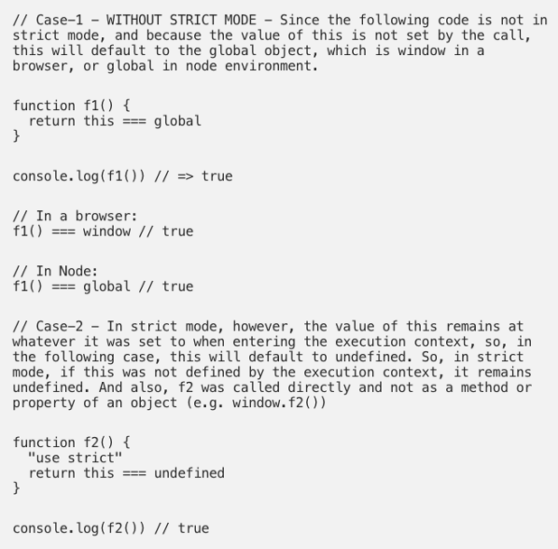
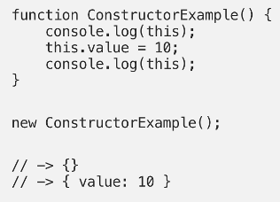
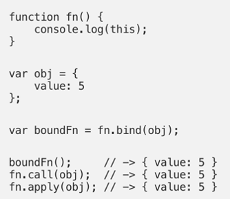
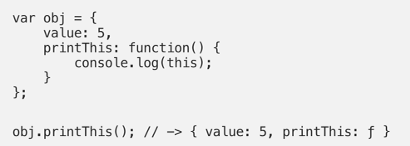
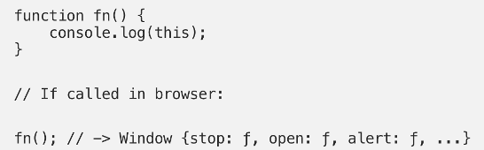
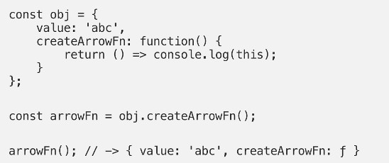

# This

* This is the JS context object in which the current code is executing.
* Without strict mode, if the value of this is not set by the call, it will default to the global object
* With strict more, the value of this remains at whatever is was set to when entering the execution context.

 

* If the new keyword is being used within the function, this inside the function is a brand new object.

 

* Is apply, call, or bind are being used to /create a function, this is the object that is passed in as the argument.

 

* If a function is called as a method, such as obj.method(), this is the object that that the function is a property of.

 

* If a function was invoked as a free function (none of the above conditions apply), this is the global object. In a browser = window object. If use strict, this will be undefined. 

 

* If multiple rules apply, the highest wins and sets the this value.
* If an arrow function, all the rules above don’t apply and this refers to the value of the surrounding scope when called.

 

## References
- https://codeburst.io/the-simple-rules-to-this-in-javascript-35d97f31bde3 
- https://stackoverflow.com/questions/3127429/how-does-the-this-keyword-work/3127440#3127440 

