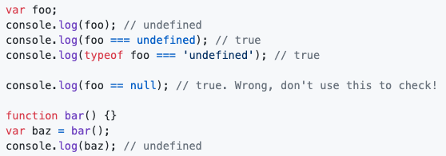

# Undeclared, Undefined, Null Variables

## Undeclared
Undeclared variables are variables that have been assigned a value but without having been declared previously via "var", "let" or "const".

Undeclared variables will be moved to the global scope:
```
function example1(){
    x = 1;
}
example1();
console.log(x);  // 1
```
However, doing so in strict mode will return a reference error: 
```
function example2(){
    'strict mode'
    x = 1;
}
example2(); //reference error
```
Undeclared variables are bad and should be avoided.

## Undefined Variables
Oppositely, undefined variables are variables that have been declared, but not yet assigned a value. And if a function that does not return a value is assigned to a variable, it will also be of a type undefined.


